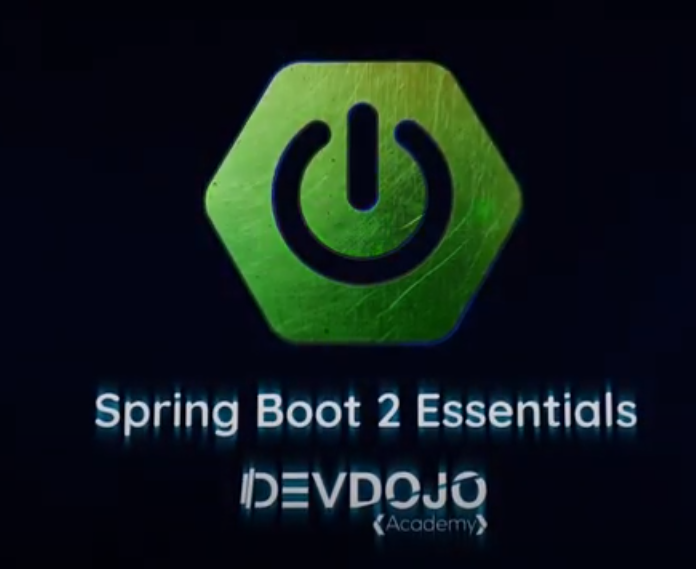

# Curso Spring Boot 2 Essentials DevDojo 

Lista do conteúdo relevante a todo curso Spring Boot Essentials. Para mais informações acesse o curso no youtube, segue link abaixo.
* [Acesse as aulas do DevDojo clicando aqui](https://www.youtube.com/watch?v=bCzsSXE4Jzg&list=PL62G310vn6nFBIxp6ZwGnm8xMcGE3VA5H)

## Ementa do Curso

> ### SPRING BOOT ESSENTIALS 2:

- **01. O que È Spring Boot**
- **02. Criando projeto na pedreiragem pt 01**
- **03. Criando projeto na pedreiragem pt 02**
- **04. Setup do projeto com Spring Initializr**
- **05. Padr√£o REST e POST**
- **06. Padr√£o REST e POST 2**
- **07. Padr√£o REST, PUT e DELETE 3**
- **08. Adicionando Spring Data JPA com MySQL**
- **09. Adicionando Spring Data JPA com MySQL 2**
- **10. Tratamento de Erros em REST**
- **11. Tratamento de Erros em REST - Exception Handler**
- **12. Tratamento de Erros em REST - Transações**
- **13. Tratamento de Erros em REST - Validação de Campos**
- **14. Tratamento de Erros em REST - Padronizando todos os Erros**
- **15. Paginação em Requisições REST**
- **16. Ordenação em Requisições REST**
- **17. Spring Security - Autenticação e Autorização**
- **18. Spring Security - Autenticação e Autorização com Spring Data**
- **19. Spring Security - Proteção das URLs com AntMatcher**
- **20. Exemplo de Conex√£o Usando Java Puro**
- **21. Cliente Spring com RestTemplate GET**
- **22. Cliente Spring com RestTemplate GET Pageable**
- **23. Cliente Spring com RestTemplate POST**
- **24. Cliente Spring com RestTemplate PUT e DELETE**
- **25. Testes Unitários para o Repositório com @DataJpaTest**
- **26. Atualizando SpringBoot e Resolvendo Bugs de Importação**
- **27. Testes de Integração com MockMVC, Mockito e AssertJ**
- **28. Testes de Integração com MockMVC, Mockito e AssertJ 2**
- **29. Executando Springboot como Serviço Init**
- **30. Spring Security - JWTToken Authentication**
- **31. Spring Security - CORS**
- **32. Refatoração dos Testes para Executar com Token**
- **33. Documentation With Swagger2 And SpringFox**
