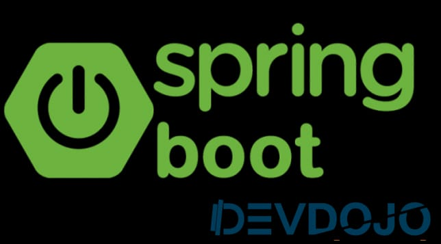

# Curso Spring Boot DevDojo

Lista do conteúdo relevante a todo curso Spring Boot Essentials. Para mais informações acesse o curso no youtube, segue link abaixo.
* [Acesse as aulas do DevDojo clicando aqui](https://www.youtube.com/watch?v=R-F-UcDo_5I&list=PL62G310vn6nF3gssjqfCKLpTK2sZJ_a_1)

## Ementa do Curso

> ### SPRING BOOT ESSENTIALS:

- **01. Setup do Projeto**
- **02. @Component, @Autowired e @SpringBootApplication**
- **03. Configurando hot swap**
- **04. Setup do projeto com Spring Initializr**
